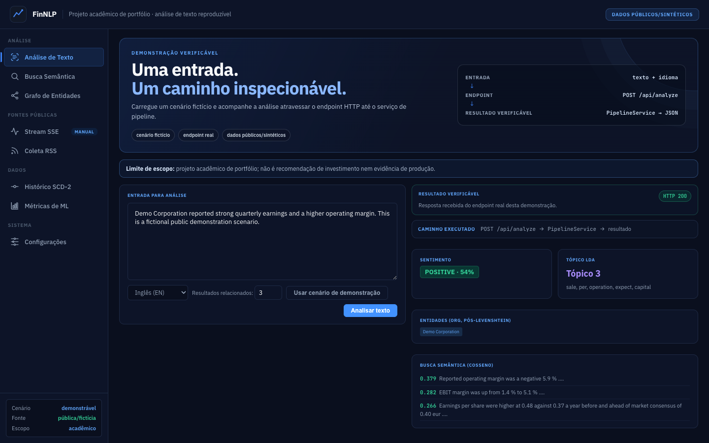
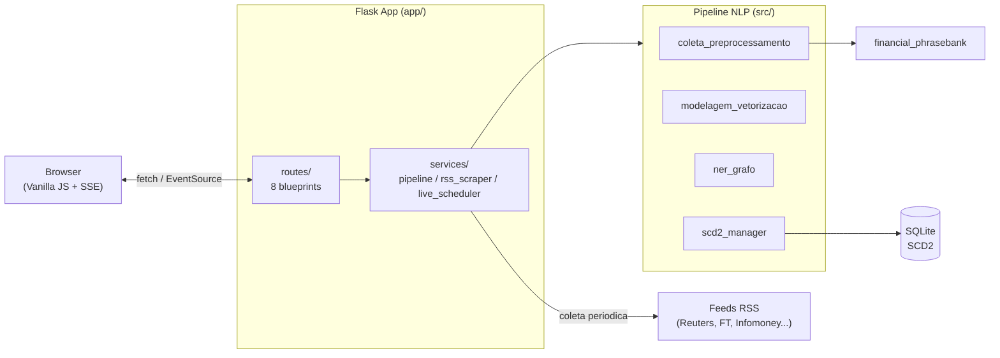
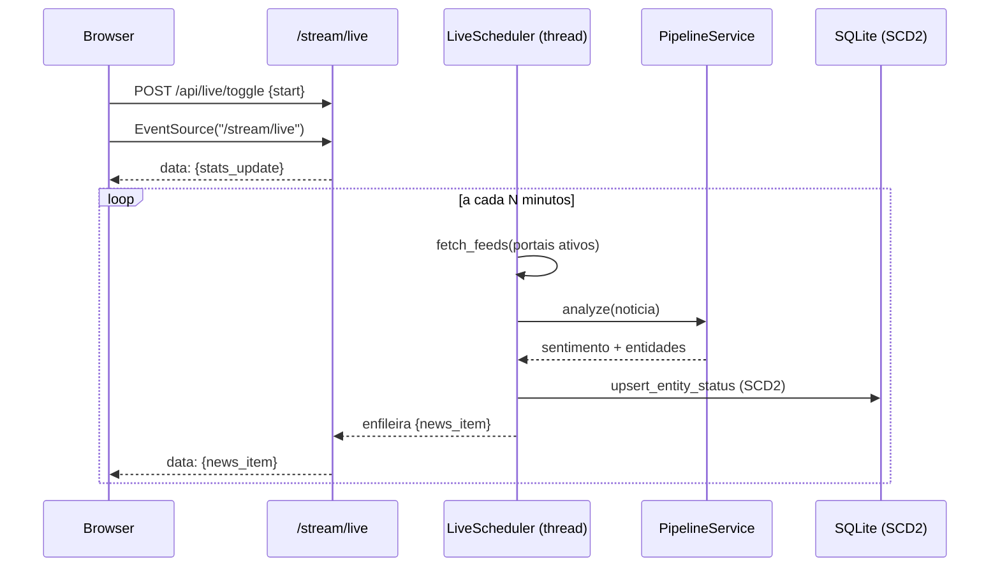

<div align="center">
  

  <h1>FinNLP — demonstração verificável de NLP financeiro</h1>

  <p><strong>Demonstração de NLP financeiro:</strong> classificação de sentimento, busca semântica,
  grafo de conhecimento e análise de texto reproduzível.</p>

  <p>
    
    
    
    
    
    
    
  </p>
</div>

---

## 📑 Índice

- [O que é](#-o-que-é)
- [Demonstração dos Módulos](#️-demonstração-dos-módulos)
- [Arquitetura](#️-arquitetura)
- [Stack Tecnológica](#-stack-tecnológica)
- [Instalação](#-instalação)
- [Como Usar](#-como-usar)
- [Estrutura do Projeto](#-estrutura-do-projeto)
- [Documentação Detalhada](#-documentação-detalhada)
- [Testes](#-testes)
- [Solução de Problemas](#️-solução-de-problemas)
- [Origem Acadêmica](#-origem-acadêmica)

---

## 🎯 O que é

O **FinNLP** é uma demonstração _end-to-end_ que transforma textos financeiros públicos ou
sintéticos em sinais exploratórios: sentimento, entidades, tópico e similaridade. Combina um
pipeline de Processamento de Linguagem Natural com uma aplicação web que torna o caminho de
execução inspecionável — da interface ao endpoint e ao serviço de pipeline.

> **Contexto:** projeto de origem acadêmica. O cliente ("Gestão do Fundo") é **fictício e
> genérico** — nenhuma instituição real é referenciada. Dados públicos
> (`financial_phrasebank`) e/ou sintéticos, anonimizados.

**Capacidades centrais:**

| Capacidade | Descrição |
|---|---|
| 🧠 **Classificação de sentimento** | Naive Bayes vs SVM treinados em corpus financeiro rotulado (Risco / Oportunidade / Neutro) |
| 🔍 **Busca semântica** | Motor de similaridade de cosseno sobre TF-IDF + Word2Vec |
| 🧩 **Modelagem de tópicos** | LDA com visualização interativa (pyLDAvis) |
| 🕸️ **Grafo de conhecimento** | NER (spaCy) + RegEx + Levenshtein → rede de entidades com centralidade |
| 🕓 **Versionamento histórico** | SCD Tipo 2 (SQLAlchemy/SQLite) rastreia a evolução do sentimento por entidade |
| 📡 **Stream opcional** | Coleta RSS sob demanda + push via Server-Sent Events (SSE), com início explícito |
| 📊 **Rastreamento de ML** | Experimentos versionados com MLflow |

---

## 🔎 Demonstração verificável



A primeira tela abre em **Análise de Texto**, não em um feed simulado. O botão
**Carregar cenário** insere um texto fictício, identificado como tal, e a ação
**Analisar** faz uma chamada real a `POST /api/analyze`.

O retorno visível mostra sentimento, entidades, tópico e textos semanticamente similares,
além do traço `POST /api/analyze → PipelineService → resultado`. Assim, quem avalia o
projeto consegue separar a interface do caminho de execução que a sustenta.

> **Limite de escopo:** projeto acadêmico e de portfólio, com dados públicos e/ou sintéticos.
> Não é recomendação de investimento, nem demonstração de um ambiente de produção.

### O que vale inspecionar tecnicamente

- `app/routes/analysis.py`: contrato HTTP fino para a análise;
- `app/services/pipeline.py`: carregamento lazy, thread-safe e pipeline de inferência;
- `src/scd2_manager.py`: persistência temporal por SCD Tipo 2;
- `tests/`: testes de fábrica, rotas, serviço e parsing de feed.

---

## 🖥️ Demonstração dos Módulos

A plataforma tem **8 módulos** acessíveis por um sidebar persistente (navegação SPA, sem reload):

| Módulo | Ícone | O que faz |
|---|:---:|---|
| **Análise de Texto** | ⚡ | Cola uma notícia → sentimento + entidades (NER) + tópico LDA + documentos similares |
| **Busca Semântica** | 🔍 | 3 consultas pré-definidas de _performance attribution_ + consulta livre por cosseno |
| **Grafo de Entidades** | ◉ | Grafo interativo (PyVis) + ranking de centralidade / risco de contágio sistêmico |
| **Histórico SCD2** | 📈 | Linha do tempo do sentimento de cada entidade ao longo do tempo |
| **Métricas ML** | 📊 | Matrizes de confusão (NB vs SVM), tópicos LDA, projeção t-SNE de embeddings |
| **Coleta RSS** | 📡 | Consulta manual a fontes RSS públicas selecionadas, com classificação local |
| **Stream SSE** | 🌐 | Sessão opcional iniciada manualmente; transmite os eventos de coleta via SSE |
| **Configurações** | ⚙ | Portais RSS ativos, intervalo de coleta, modelo e idioma |

> Guia detalhado de cada módulo em **[docs/USAGE.md](docs/USAGE.md)**.

---

## 🏗️ Arquitetura

O frontend nunca toca os módulos de NLP diretamente: tudo passa pela camada `app/services/`,
que encapsula o pipeline `src/` e carrega os modelos uma única vez (_lazy warmup_).



**Fluxo opcional do Stream SSE (sob demanda):**



> Detalhes de design, modelo de dados SCD2 e estratégia SSE em
> **[docs/ARCHITECTURE.md](docs/ARCHITECTURE.md)**.

---

## 🧰 Stack Tecnológica

| Camada | Tecnologias |
|---|---|
| **Backend** | Flask 3.1 (Application Factory + Blueprints), Server-Sent Events |
| **NLP** | spaCy 3.7, NLTK, scikit-learn 1.4, gensim (Word2Vec), pyLDAvis |
| **Dados** | pandas, SQLAlchemy 2.0 (SQLite), feedparser (RSS) |
| **Grafo** | NetworkX, PyVis, python-Levenshtein |
| **ML Ops** | MLflow 2.12 |
| **Frontend** | HTML5 + CSS custom properties + Vanilla JS (sem build, sem npm) |
| **Testes** | pytest (19 testes) |

---

## 📦 Instalação

> Requer **Python 3.12** (CPU-only). Recomendado o gerenciador [`uv`](https://docs.astral.sh/uv/).

```bash
# 1. Clonar
git clone git@github.com:fabioffigueiredo/finnlp_performance_attribution.git
cd finnlp_performance_attribution

# 2. Ambiente virtual
uv venv .venv --python 3.12
source .venv/bin/activate          # Windows: .venv\Scripts\activate

# 3. Dependências
uv pip install -r requirements.txt
#   (sem uv: pip install -r requirements.txt)

# 4. Modelos de linguagem do spaCy
uv pip install \
  "en-core-web-sm @ https://github.com/explosion/spacy-models/releases/download/en_core_web_sm-3.7.1/en_core_web_sm-3.7.1-py3-none-any.whl" \
  "pt-core-news-sm @ https://github.com/explosion/spacy-models/releases/download/pt_core_news_sm-3.7.0/pt_core_news_sm-3.7.0-py3-none-any.whl"

# 5. Recursos do NLTK (uma vez)
python -c "import nltk; [nltk.download(p, quiet=True) for p in ('punkt','punkt_tab','stopwords','rslp')]"
```

> Guia de instalação passo a passo (incluindo sem `uv`) em **[docs/INSTALL.md](docs/INSTALL.md)**.

---

## 🚀 Como Usar

### Aplicação Web

```bash
python app/app.py
# Acesse http://localhost:5001
```

- A **primeira análise** dispara o _warmup_ (baixa o corpus ~50 MB + treina os modelos),
  levando ~30-60s. Requisições seguintes são instantâneas.
- O módulo **Stream SSE** é opcional e começa somente pelo botão *Iniciar demonstração*.
  Ele usa fontes RSS configuradas, não é acionado pelo cenário de análise reproduzível e não
  representa monitoramento contínuo ou uso produtivo.

### Notebook (pipeline acadêmico end-to-end)

```bash
jupyter notebook notebooks/FinNLP_Pipeline.ipynb     # Kernel > Restart & Run All
```

### MLflow (experimentos)

```bash
mlflow ui                                            # http://localhost:5000
```

### Variáveis de ambiente

| Variável | Padrão | Descrição |
|---|---|---|
| `PORT` | `5001` | Porta do servidor Flask |

---

## 📂 Estrutura do Projeto

```
finnlp_performance_attribution/
├── app/                          # Aplicação web (Flask)
│   ├── app.py                    # Application factory
│   ├── config.py                 # AppState (portais, intervalo, modelo)
│   ├── routes/                   # 8 blueprints (pages + APIs + SSE)
│   ├── services/                 # pipeline / rss_scraper / live_scheduler
│   ├── templates/                # base.html + 8 fragmentos de módulo
│   └── static/                   # css/ (Dark Financial) / js/ (SPA, SSE) / img/
├── src/                          # Pipeline NLP (reutilizado pelo app e notebook)
│   ├── coleta_preprocessamento.py
│   ├── modelagem_vetorizacao.py
│   ├── ner_grafo.py
│   └── scd2_manager.py
├── reports/                      # Relatório PDF + visualizações
│   └── images/finnlp-verifiable-analysis.png  # captura real do endpoint no cenário fictício
├── data/                         # Corpus processado, grafo (GEXF), banco SCD2
├── docs/                         # Documentação (este diretório)
├── tests/                        # 21 testes (pytest)
├── requirements.txt
└── README.md
```

---

## 📚 Documentação Detalhada

| Documento | Conteúdo |
|---|---|
| **[docs/USAGE.md](docs/USAGE.md)** | Guia de uso de cada um dos 8 módulos, com exemplos |
| **[docs/API.md](docs/API.md)** | Referência completa dos endpoints REST e do stream SSE |
| **[docs/ARCHITECTURE.md](docs/ARCHITECTURE.md)** | Arquitetura, camada de serviços, fluxo SSE e modelo SCD2 |
| **[docs/INSTALL.md](docs/INSTALL.md)** | Instalação detalhada e configuração do ambiente |

---

## ✅ Testes

```bash
PYTHONPATH=. pytest tests/ -v
```

Cobre: factory Flask, inicialização segura da demo, `PipelineService` (warmup + análise),
parsing RSS e os endpoints de API.

```
18 passed
```

---

## 🛠️ Solução de Problemas

| Sintoma | Causa / Solução |
|---|---|
| `ModuleNotFoundError: app.routes` | Rode a partir da raiz; `python app/app.py` já ajusta o path. |
| Análise demora na 1ª vez | _Warmup_ baixando o corpus (~50 MB) e treinando modelos. Normal (~30-60s). |
| `Address already in use` (porta 5001) | Outro servidor ativo: `PORT=5002 python app/app.py` ou encerre o anterior. |
| Feeds RSS vazios no Live | Portais podem estar indisponíveis; o scraper faz _skip_ silencioso. Verifique os portais em ⚙. |
| `pkg_resources` warning (mlflow) | Benigno. `setuptools<81` já está fixado no `requirements.txt`. |
| Grafo vazio em ◉ | Rode o notebook para gerar `data/processed/grafo_conhecimento.gexf`. |

Mais cenários em **[docs/INSTALL.md](docs/INSTALL.md)**.

---

## 🎓 Origem Acadêmica

Este projeto nasceu como entrega da disciplina **Processamento de Linguagem Natural** da
**Pós-Graduação em Machine Learning, Deep Learning e Inteligência Artificial** (INFNET),
sob orientação do **Prof. Fernando Guimarães Ferreira**, e foi estendido com a camada de
aplicação web e monitoramento em tempo real.

A versão estritamente acadêmica (notebook + relatório PDF) está em
[**pd-nlp-finnlp**](https://github.com/fabioffigueiredo/pd-nlp-finnlp).

**Autor:** Fabio Ferreira Figueiredo ·
<a href="https://github.com/fabioffigueiredo">GitHub</a>

---
<div align="center">
  <small>Desenvolvido para fins acadêmicos e de portfólio · 2026</small>
</div>
