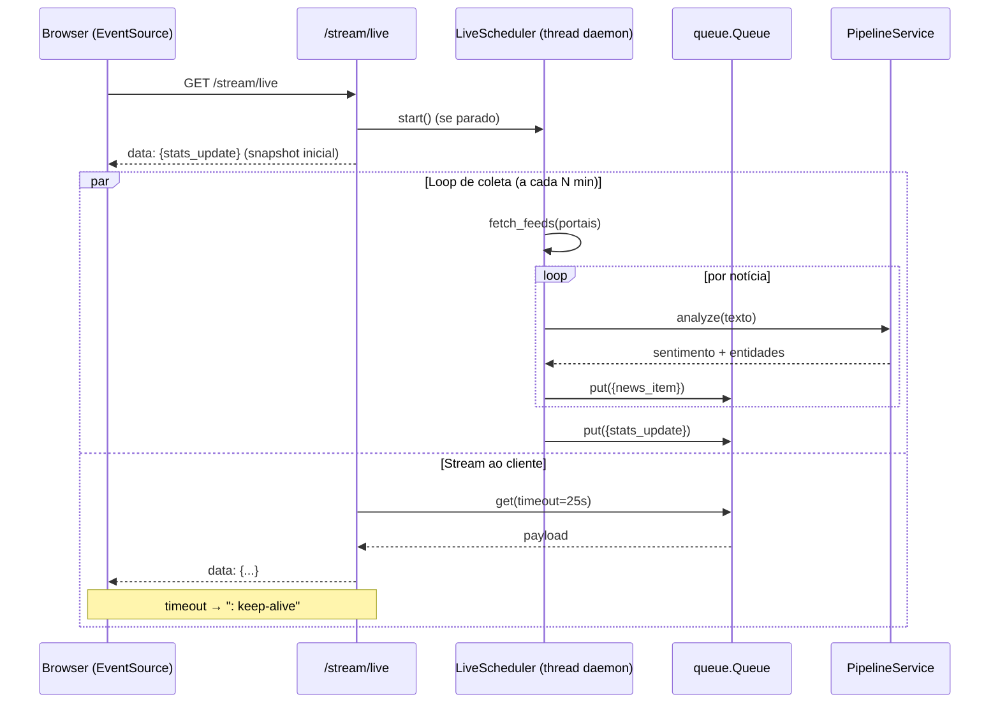
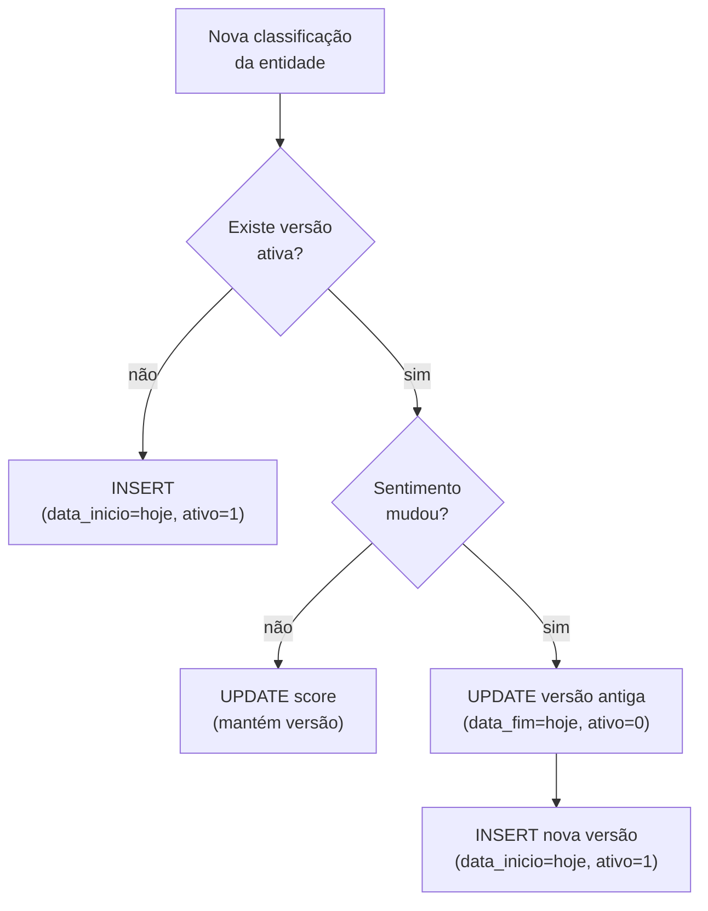

# Arquitetura — FinNLP

Documento de design da plataforma: camadas, fluxo de dados, estratégia de tempo real e
modelo de dados histórico (SCD Tipo 2).

---

## 1. Princípio central

> **O frontend nunca importa `src/` diretamente.** Toda a inferência passa pela camada
> `app/services/`, que encapsula o pipeline e mantém os modelos em memória.

Isso isola a aplicação web da assinatura interna dos módulos de NLP, permite _mock_ nos
testes e evita recarregar modelos a cada requisição.

```
Browser ──HTTP/SSE──▶ app/routes ──▶ app/services ──▶ src/ (pipeline NLP)
```

---

## 2. Camadas

### 2.1 `app/routes/` — Blueprints
Um blueprint por área. As rotas são finas: validam entrada, chamam um serviço e serializam
a saída em JSON. Nenhuma lógica de NLP vive aqui.

| Blueprint | Responsabilidade |
|---|---|
| `pages` | Shell (`/`) e fragmentos de módulo (`/m/<module>`) |
| `analysis` | `POST /api/analyze` |
| `search` | `POST /api/search` |
| `graph` | `GET /api/graph`, `/api/graph/html` |
| `history` | `GET /api/history/*` |
| `metrics` | `GET /api/metrics`, imagens |
| `feed` | `POST /api/feed/fetch` |
| `live` | `GET /stream/live` (SSE), `POST /api/live/toggle` |
| `config_api` | `GET/POST /api/config` |

### 2.2 `app/services/` — Camada de serviço

**`pipeline.py` → `PipelineService` (singleton `PIPELINE`)**
- `warmup()`: carrega o `financial_phrasebank`, lematiza, treina TF-IDF + SVM + LDA e
  carrega o modelo spaCy. Idempotente e _thread-safe_ (protegido por `Lock`).
- `analyze(text, lang, top_n)`: sentimento + confiança + entidades (NER+Levenshtein) +
  tópico LDA dominante + busca semântica.
- `search(query, top_n)`: top-N por cosseno.
- O carregamento é **lazy**: só ocorre na primeira chamada que precisa do pipeline.

**`rss_scraper.py`**
- `fetch_feeds(portals, max_per_feed)`: busca via `feedparser`, normaliza títulos/resumos,
  faz _skip_ silencioso de feeds indisponíveis (nunca derruba o app).
- `parse_feed_entries(entries, portal)`: normalização pura (testável sem rede).

**`live_scheduler.py` → `LiveScheduler` (singleton `SCHEDULER`)**
- Thread _daemon_ que, a cada `interval_minutes`, coleta → classifica → persiste (SCD2) →
  publica eventos numa `queue.Queue`.
- `stream()`: gerador que consome a fila e formata eventos SSE.

### 2.3 `app/config.py` — Estado em memória
`AppState` (singleton `STATE`) guarda portais ativos, intervalo, modelo e idioma.
`RSS_FEEDS` é o registro de portais → URLs.

### 2.4 `src/` — Pipeline NLP
Os 4 módulos do projeto acadêmico, reutilizados sem alteração:
`coleta_preprocessamento`, `modelagem_vetorizacao`, `ner_grafo`, `scd2_manager`.

---

## 3. Navegação SPA (sem framework)

`app/static/js/app.js` implementa navegação _single-page_ com Vanilla JS:

```
clique no .nav-item
   └─▶ fetch(`/m/<module>`)        # busca o fragmento HTML
        └─▶ #content.innerHTML = …  # injeta sem reload
             └─▶ history.pushState  # atualiza a URL (#módulo)
                  └─▶ MODULE_INIT[module]()  # inicializador do módulo
```

Cada módulo registra seu inicializador em `window.MODULE_INIT` (em `analysis.js`,
`live.js`, `modules.js`). O sidebar e a conexão SSE permanecem vivos durante a navegação.

---

## 4. Tempo real via Server-Sent Events

Optou-se por **SSE** em vez de WebSocket: o fluxo é **unidirecional** (servidor → cliente),
SSE é nativo no Flask (`Response` + gerador) e no browser (`EventSource`, com reconexão
automática), sem dependências extras.



**Eventos:** `news_item` (notícia classificada) e `stats_update` (contadores agregados).

---

## 5. Modelo de dados — SCD Tipo 2

A tabela `Dim_Ativo_Status` (SQLite, via SQLAlchemy) versiona o sentimento de cada
entidade ao longo do tempo, em vez de sobrescrever.

| Coluna | Descrição |
|---|---|
| `id_versao` | PK (surrogate key) |
| `nome_entidade` | Organização (chave de negócio) |
| `sentimento` | positive / neutral / negative |
| `score_centralidade` | Centralidade de grau no grafo |
| `topico_lda` | Tópico LDA associado |
| `data_inicio` | Início de validade da versão |
| `data_fim` | Fim de validade (`NULL` = versão atual) |
| `status_ativo` | `True` para a versão corrente |

**Regra de _upsert_ (`upsert_entity_status`):**



Isso permite responder _"quando e por que o sentimento desta empresa mudou?"_ — base para
backtesting e auditoria das análises de performance attribution.

---

## 6. Decisões de design (resumo)

| Decisão | Justificativa |
|---|---|
| Flask + Vanilla JS (sem npm) | Zero _build pipeline_; roda com `python app/app.py`; fácil de avaliar/reproduzir |
| SSE em vez de WebSocket | Fluxo unidirecional; nativo no Flask e no browser; reconexão automática |
| Camada `services/` isolando `src/` | Testabilidade (mock), _warmup_ único, baixo acoplamento |
| Lazy warmup | Evita custo de inicialização até a primeira análise real |
| RSS em vez de scraping HTML | Estável, sem bloqueio anti-bot, mesma informação |
| SQLite/SCD2 | Serverless, adequado ao escopo; trocável por Postgres via SQLAlchemy |
| Singletons de processo (`PIPELINE`, `SCHEDULER`, `STATE`) | Estado compartilhado simples para um único processo Flask |

---

## 7. Limites conhecidos

- **Single-process:** os singletons assumem um processo. Para escalar horizontalmente,
  o estado (`STATE`, fila SSE) precisaria de um backend compartilhado (ex.: Redis).
- **Classificador em inglês:** treinado no `financial_phrasebank`; notícias PT-BR têm
  menor precisão de sentimento.
- **Grafo estático:** carregado do GEXF gerado pelo notebook; não é recomputado a cada
  coleta do Live (apenas o SCD2 é atualizado em tempo real).
